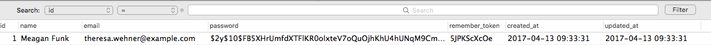
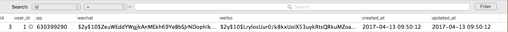

# EloquentORM关联关系之一对一

## 数据版本

* Laravel Version 5.4.19

* PHP Version 7.0.8

## 关键字

* `hasOne()`

* `belongsTo()`

数据操作之前请先配置好，数据库的一些连接信息。例如下面使用mysql数据库，修改项目根目录下的 `.env` 文件内容。

```
DB_CONNECTION=mysql
DB_HOST=127.0.0.1
DB_PORT=3306
DB_DATABASE=db_name
DB_USERNAME=db_username
DB_PASSWORD=db_password
```

一对一是最简单的关联关系，表示表A和表B的记录一一对应。

比如一个用户对应一个社交账号，在演示该关联关系之前我们先创建一个社交账号表 `user_accounts` （**假设用户表使用系统自带的**）

## 生成迁移文件

```shell
php artisan make:migration create_user_accounts_table --create=user_accounts
```


### 编辑生成的迁移文件

`<project>/database/migrate/*_create_user_accounts_table.php`如下

```php
<?php

use Illuminate\Support\Facades\Schema;
use Illuminate\Database\Schema\Blueprint;
use Illuminate\Database\Migrations\Migration;

class CreateUserAccountsTable extends Migration
{
    /**
     * Run the migrations.
     *
     * @return void
     */
    public function up()
    {
        Schema::create('user_accounts', function (Blueprint $table) {
            $table->increments('id');
            $table->integer('user_id')->unsigned();
            $table->char('qq', 12)->nullable();
            $table->string('wechat', 100)->nullable();
            $table->string('weibo', 100)->nullable();
            $table->timestamps();
            $table->foreign('user_id')
                      ->references('id')
                      ->on('users')
                      ->onUpdate('cascade')
                      ->onDelete('cascade');
        });
    }

    /**
     * Reverse the migrations.
     *
     * @return void
     */
    public function down()
    {
        Schema::dropIfExists('user_accounts');
    }
}
```


### 运行 php artisan 命令保存修改到数据库

```shell
php artisan migrate
```

> 执行上面的命令后数据库将生成四张表，
> migrations
> password_resets
> user_accounts
> users

### 使用 php artisan 命令生成模型
```
php artisan make:model UserAccount
```

并定义可填充的数据，即 $fillable 数组的值。
```
<?php

namespace App;

use Illuminate\Database\Eloquent\Model;

/**
 * Class UserAccount
 *
 * @package App
 */
class UserAccount extends Model
{
    /**
     * @var array
     */
    protected $fillable = ['user_id', 'qq', 'wechat', 'weibo'];
}
```

### 使用 tinker 填充数据
修改 `/databases/factories/ModelFactory.php`，新增关联数据。
```
<?php

/*
|--------------------------------------------------------------------------
| Model Factories
|--------------------------------------------------------------------------
|
| Here you may define all of your model factories. Model factories give
| you a convenient way to create models for testing and seeding your
| database. Just tell the factory how a default model should look.
|
*/

/** @var \Illuminate\Database\Eloquent\Factory $factory */
$factory->define(App\User::class, function (Faker\Generator $faker) {
    static $password;

    return [
        'name' => $faker->name,
        'email' => $faker->unique()->safeEmail,
        'password' => $password ?: $password = bcrypt('secret'),
        'remember_token' => str_random(10),
    ];
});

$factory->define(App\UserAccount::class, function (Faker\Generator $faker) {
    return [
        'user_id' => 1,
        'qq' => $faker->numberBetween(100000, 999999999),
        'wechat' => bcrypt('secret'),
        'weibo' => bcrypt('secret')
    ];
});
```

### 执行上述迁移文件填充数据到数据库
```shell
php artisan tinker

// 进入到交互界面执行如下命令生成关联数据
namespace App
factory(User::class,1)->create() // 随机生成一个用户信息
factory(UserAccount::class,1)->create() // 随机生成一个用户关联信息
```

### 查看执行结果
在两个表中可以看到写入的数据：

`users`表数据：



`users_accounts`表：




## 定义Eloquent关联关系

文件在`<project>/app/User.php`和`<project>/app/UserAccount.php`。

### 定义关联关系

- 在 `User` 模型中定义与 `UserAccount` 模型的一对一对应关系

```php
<?php
namespace App;
use Illuminate\Database\Eloquent\Model;
class User extends Model
{
    
...

   /**
     * @return \Illuminate\Database\Eloquent\Relations\HasOne
     */
    public function account()
    {
        /**
         * UserAccount::class related 关联模型
         * user_id foreignKey 当前表关联字段
         * id localKey 关联表字段
         */
        return $this->hasOne(UserAccount::class, 'user_id', 'id');
    }
}
```

- 在 `UserAccount` 模型中定义与 `User` 的一对一关系
```php
<?php
namespace App;
use Illuminate\Database\Eloquent\Model;
class UserAccount extends Model
{

... 

    /**
     * @return \Illuminate\Database\Eloquent\Relations\BelongsTo
     */
    public function user()
    {
        /**
         * User::class related 关联模型
         * user_id ownerKey 当前表关联字段
         * id relation 关联表字段
         */
        return $this->belongsTo(User::class, 'user_id', 'id');
    }
}
```

## 关联操作

### 新增数据
同时新增 `users` 和 `user_accounts` 表数据
```
$user = \App\User::create([
  'name' => 'curder',
  'email' => 'curder@foxmail.com',
  'password' => bcrypt('secret'),
  'remember_token' => str_random(10),
]); // 新增一个用户信息

$account = new \App\UserAccount(['qq' => 'qq Number', 'wechat' => 'wechatNumber', 'weibo' => 'weiboNumber']); // 生成 UserAccount 对象

$user->account()->save($account); // 执行关联写入操作
```
> 也可以是我们使用 `find()` 方法获得用户信息（或者使用 `\Auth::id()`获得用户信息），再写入到关联表 `user_accounts`。如下：（这种情况常见于用户修改创建、修改自己的账户信息）
> ```
>  $account = new \App\UserAccount(['qq' => 'another qq', 'wechat' => 'another wechat', 'weibo' => 'another weibo']); // 生成 UserAccount 对象，或者数据通过 Request 对象获取 $account = new \App\Account($request->all());
>  \Auth::user()->account()->save($account);
> ```


### 查询数据

通过用户获取用户关联信息

```php
$user = User::find(1); // 获取用户表数据

$user->account; // 通过用户信息获取用户关联信息
```

通过用户关联信息获取用户信息

```php
$account = UserAccount::find(3); // 获取用户关联信息

$account->user; // 通过关联信息获取用户信息
```

### 关联删除

```
$account = \App\UserAccount::find(1);
$account->user->delete(); // 删除用户 users 表和 user_account 相关记录
```


### 更新数据

通过用户表 `users` 数据，更新关联 `user_accounts`

```
$user = \App\User::find(1);
$account = $user->account; // 获取到关联信息
$account->qq = 'new qq';
$account->wechat = 'new Wechat';
$account->save();

// 或者当用户登录时，直接通过关联关系进行更新数据
\Auth::user()->account()->update(['qq' => 'new QQ', 'wechat' => 'new Wechat']);
```

通过 用户信息表 `user_accounts` 关联更新 `users` 数据表

```
$account = \App\UserAccount::find(1);
$user = $account->user; // 获取到关联信息

$user->email = 'new@test.com';
$user->save();
```

#### 通过关联 User 数据
另外，如果需要同步更新关联表的 `updated_at` 字段，在模型中定义 `$touches` 属性，例如，我们在 UserAccount 中定义如下关系：
```
/**
 * 要触发的所有关联关系
 *
 * @var array
 */
 protected $touches = ['user'];
```
在更新 `user_accounts` 表中数据时，同步更新 `users` 表的 `updated_at` 数据。


