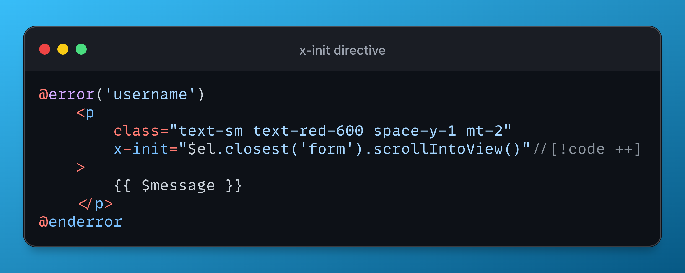

# 使用 Alpine.js 滚动到验证错误



Laravel 有一个名为 `@error` 的简洁模版指令，可以使用它来显示给定字段的验证错误消息。

例如，如果表单中有一个 `username` 字段，并且想显示它的验证错误消息，可以这样做：

```php
<div>
    <label class="..." for="username">用户名</label>
    
    <input wire:model="username"
           class="..."
           id="username" type="text" name="username" value=""/>

    @error('username')
        <p class="text-sm text-red-600 space-y-1 mt-2">{{ $message }}</p>
    @enderror
</div>
```

`@error` 指令将显示名称字段的验证错误消息（如果有）。

但这样做的问题是，如果表单很长并且验证错误发生在不在窗口的地方，用户将无法看到错误消息，而这并不是一个好的用户体验。

这个问题可以借助 [Alpine.js](https://alpinejs.dev/directives/init) 来解决，正如 [Caleb Porzio 的推文](https://twitter.com/calebporzio/status/1725220835076534690)中所精确描述的那样。

因此可以做的是，可以在错误消息容器上添加 `x-init` 指令，然后调用一个方法，如果错误消息容器在页面上可见，则将页面滚动到错误消息容器。

```php
@error('username')
    <p 
        class="text-sm text-red-600 space-y-1 mt-2"
        x-init="$el.closest('form').scrollIntoView()"//[!code ++]
    >
        {{ $message }}
    </p>
@enderror
```

如果错误消息容器在页面上可见，`x-init` 指令中的代码会将页面滚动到最近的表单元素。

这样，用户将能够看到所有验证错误，即使它们不在窗口中。