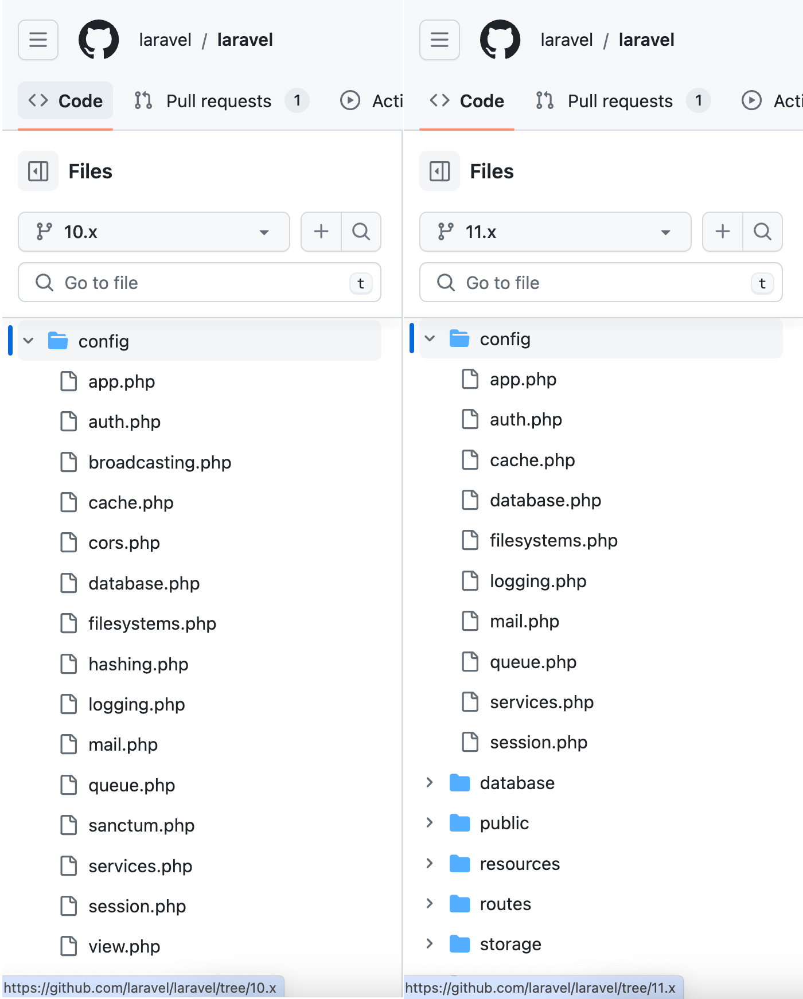
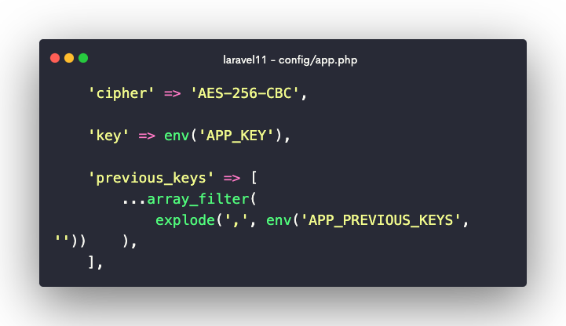

# Laravel 11

[Laravel 11](https://github.com/laravel/laravel/tree/11.x) 现已发布，包括最低 PHP v8.2、Sqlite 3.35.0+、新的 Laravel Reverb 包、简化的目录结构等等。

下面是 Laravel 版本的支持周期表，可以[点击这里查看官方说明](https://laravel.com/docs/master/releases#support-policy)：

| 版本  | 	PHP       | 	发布	              | 错误修复直至           | 	安全修复直至         |
|-----|------------|-------------------|------------------|-----------------|
| 10	 | 8.1 - 8.3	 | 2023 年 2 月 14 日   | 	2024 年 8 月 6 日	 | 2025 年 2 月 4 日  |
| 11  | 	8.2 - 8.3 | 	2024 年 3 月 12 日	 | 2025 年 9 月 3 日	  | 2026 年 3 月 12 日 |
| 12  | 	8.2 - 8.3 | 	2025 年第一季度       | 	2026 年第三季度	     | 2027 年第一季度      |

更多发行说明请参考[官方说明](https://laravel.com/docs/11.x/releases)。

## 简化目录结构

### 配置文件 config

Laravel 项目默认的配置文件在 `config` 目录下，可以看到相比 Laravel 10 的项目配置文件，Laravel 11 移除了部分默认的配置文件。

::: details 查看 `config` 默认配置差异

:::

如果需要随时可以通过 `config:publish` 命令重新发布。

```php
# 发布 broadcasting 配置文件
php artisan config:publish broadcasting

# 发布 view 配置文件 
php artisan config:publish view
```

### 服务提供者 Providers

在 [Laravel 10](https://github.com/laravel/laravel/blob/10.x/config/app.php#L158) 中可以在 `config/app.php` 中的数组配置中注册自定义的服务提供者。

而 [Laravel 11](https://github.com/laravel/laravel/blob/11.x/config/app.php) 中 `config/app.php` 中并没有自定义服务提供者的配置项。

> [!TIP] 提示
> **默认情况下，Laravel 11 中通过 `make:provider` 命令创建的服务提供者文件自动加载，而无需手动进行配置。**
> 
> 因为 [Laravel 11](https://github.com/laravel/laravel/blob/11.x/bootstrap/providers.php) 中的服务器提供者的配置文件在 `bootstrap/providers.php` 中以数组的形式返回。

可以通过下面的流程来检验上面的说法：

1. 创建自定义服务提供者

    通过命令行创建一个服务提供者，并通过运行一个命令来触发它。
    ```bash
    php artisan make:provider TestingServiceProvider
    ```

2. 添加代码逻辑

    修改 `app/Providers/TestingServiceProvider.php` 文件，添加以下代码：

    ```php
    public function register(): void
    {
        dd('Hi there');
    }
    ```
   
3. 运行命令

    最后，在命令行中运行命令 `php artisan inspire` 可以看到命令行会输出上面的 `dd` 信息。

4. 验证自动注册服务提供者

    将 `bootstrap/providers.php` 中自动注册的 `App\Providers\TestingServiceProvider::class,` 注释，然后再次运行 `php artisan inspire` 命令，可以看到命令行不再输出上面的 `dd` 信息。

所以，在 Laravel 11 中自定义的服务提供者文件不在 `config/app.php` 中进行配置，而是在 `bootstrap/providers.php` 中进行配置，并且自定义的服务提供者如果是通过 `make:provider` 命令创建的则无需手动配置，Laravel 框架会自动注册。


### install:api

Laravel 11 项目默认移除了对 API 的支持，如果需要配置 API 路由，可以通过下面的命令安装它。

```bash
php artisan install:api
```

运行完上面的命令后，需要手动在用户模型 `app/Models/User.php` 中添加 `use Laravel\Sanctum\HasApiTokens`。

1. 下载并安装 [`laravel/sanctum`](https://laravel.com/docs/11.x/sanctum) 扩展包。

2. 自动生成 `routes/api.php` 路由文件

3. 自动开启 `api.php` 路由文件配置
   ```php
   return Application::configure(basePath: dirname(__DIR__))
       ->withRouting(
           // ...
           // api: __DIR__.'/../routes/api.php', // [!code --]
           api: __DIR__.'/../routes/api.php', // [!code ++]
           // ...
       )
   ```

### install:broadcasting

Laravel 11 项目默认移除了对广播系统的支持，如果需要配置广播系统，可以通过下面的命令安装它。

```php
php artisan install:broadcasting
```

更多广播相关使用可以参考 [Broadcasting 文档](https://laravel.com/docs/11.x/broadcasting)。


### 中间件 Middlewares

Laravel 框架自带了很多中间件来处理不同的请求，比如 `TrimStrings` 中间件用来去除请求参数和请求头中的空格。

#### 自定义默认中间件配置

相比于 [Laravel 10 的中间件](https://github.com/laravel/laravel/tree/10.x/app/Http/Middleware)，在 Laravel 11 中默认的中间件 `app/Http/Middleware` 已被移除，如果需要修改默认中间件的配置，可以在服务器提供者 `app/Providers/AppServiceProvider.php` 中进行配置。

```php
public function boot(): void
{
    # 自定义默认中间件配置
    TrimStrings::except(['secret']);
    ## 配置不加密的cookie 
    EncryptCookies::except(['some_cookie_name']);
    ## 登录成功后跳转的路由
    RedirectIfAuthenticated::redirectUsing(fn () => route('dashboard'));
    ## 未登录的用户跳转的路由
    Authenticate::redirectUsing(fn () => route('login'));
}
```

#### 自定义中间件

Laravel 10 中注册自定义中间件的位置在 [`app/Http/Kernel.php`](https://github.com/laravel/laravel/blob/10.x/app/Http/Kernel.php) 文件，而在 Laravel 11 中这个文件被移除了。

Laravel 11 中通过在配置文件 [`bootstrap/app.php`](https://github.com/laravel/laravel/blob/11.x/bootstrap/app.php#L13) 的 `withMiddleware()` 方法中进行配置。

1. 创建自定义中间件
   通过命令行终端 `make:middleware` 来创建自定义中间件，创建成功后，可以在 `app/Http/Middleware/LogRequestEndPoint.php` 中找到自定义中间件的文件。

   ```bash
   php artisan make:middleware LogRequestEndPoint
   ```

2. 添加自定义中间件逻辑

   ```php
   use Illuminate\Support\Facades\Log;
   
   public function handle(Request $request, Closure $next): Response
   {
     Log::info($request->url()); // [!code ++]

     return $next($request);
   }
   ```

3. 在 `bootstrap/app.php` 中添加自定义中间件

   ```php
   return Application::configure(basePath: dirname(__DIR__))
       //...
       ->withMiddleware(function (Middleware $middleware) {
            $middleware->web(append: LogRequestEndPoint::class); // 追加 web 中间件
            // $middleware->append(); // 追加全局中间件
            // $middleware->api(...); // 设置 api 中间件
            // $middleware->alias(...); // 设置中间件别名
       })
   ```

4. 此刻，当访问任何路由时，都会在日志中记录下访问的 URL。

### 定时任务 Schedule

在 Laravel 10 中，如果需要配置项目的定时任务可以在 [`app/Console/Kernel.php`](https://github.com/laravel/laravel/blob/10.x/app/Console/Kernel.php#L13) 的 `schedule()` 方法中进行配置。

Laravel 11 中 `app/Console/Kernel.php` 文件被删除，取而代之的是在 `routes/console.php` 中进行配置。

```php
use Illuminate\Support\Facades\Schedule;

// ...
# 每天删除模型过期数据
Schedule::command('model:prune')->daily();
```

也可以通过下面的命令对当前项目的定时任务进行查看：

```bash
php artisan schedule:list

# 输出如下:
# 0 * * * *  php artisan inspire ............ Next Due: 45 minutes from now
# 0 0 * * *  php artisan model:prune .......... Next Due: 18 hours from now
```

### 异常处理 Exceptions

与路由和中间件一样，现在可以从应用程序的 `bootstrap/app.php` 文件而不是单独的异常处理程序类来自定义异常处理，从而减少新 Laravel 应用程序中包含的文件总数：

```php
use App\Exceptions\MissedFlightException;
use App\Exceptions\InvalidOrderException;

->withExceptions(function (Exceptions $exceptions) {
    $exceptions->dontReport(MissedFlightException::class);
 
    $exceptions->report(function (InvalidOrderException $e) {
        // ...
    });
})
```

## 新特性

Laravel 11 除了简化项目配置、目录和文件外，还带来了一些新特性，它们包括 `Dumpable` 特性，

### Dumpable

#### 框架类

::: code-group

```php [Database Query Builder]
# 现在可以在模型链式调用时调用 `dump()` 或者 `dd()` 方法输出执行 SQL，方便调试。

User::query()->latest()->limit(5)->dd()->get();

# "select * from "users" order by "created_at" desc limit 5"
```

```php [Carbon]
# 在 `Carbon` 实例的链式调时使用 `dump()` 或 `dd()` 方法输出运行结果。

Carbon::now()->subDays(5)->dump()->toString();
```

```php [Stringable]
# 在 `Stringable` 实例的链式调时使用 `dump()` 或 `dd()` 方法输出运行结果

Str::of('hello ')->append('world')->apa()->dump()->toString();

# Hello World
```

:::

更多使用的类可以参考 [laravel/framework](https://github.com/laravel/framework/blob/11.x/src/Illuminate/Support/Traits/Dumpable.php#L5) 源代码。

- [Database Query Builder](https://github.com/laravel/framework/blob/11.x/src/Illuminate/Database/Query/Builder.php#L34)
- [Carbon](https://github.com/laravel/framework/blob/11.x/src/Illuminate/Support/Carbon.php#L14)
- [Testing Debugging](https://github.com/laravel/framework/blob/11.x/src/Illuminate/Testing/Fluent/Concerns/Debugging.php#L9)
- [Http InteractsWithInput](https://github.com/laravel/framework/blob/11.x/src/Illuminate/Http/Concerns/InteractsWithInput.php#L15)
- [Stringable](https://github.com/laravel/framework/blob/11.x/src/Illuminate/Support/Stringable.php#L17)
- [TestResponse](https://github.com/laravel/framework/blob/11.x/src/Illuminate/Testing/TestResponse.php#L38)


#### 自定义类

在自定义的类中直接使用 `Dumpable`。

```php
use Illuminate\Support\Traits\Dumpable;

class User
{
    use Dumpable; // [!code ++]

    public function __construct()
    {
        $this->name = 'Curder';
    }

    public function getName()
    {
        return $this->name;
    }
}

$user = new User;

$user->getName()->dump();
$user->getName()->dd();
```

### 限制惰性加载数量

Laravel 11 将允许本地限制惰性加载的条目数量。

比如当查询用户的同时需要查询对应的 10 条文章记录。

::: code-group
```php
use App\Models\User;
use Illuminate\Database\Eloquent\Relations\HasMany;

User::with([
    'posts' => fn (HasMany $query) => $query->latest()->limit(10) // [!code ++]
])->get();
```

```php [User Model]
<?php

class User extends Model
{
    public function posts()
    {
        return $this->hasMany(Post::class);
    }
}
```

```php [Post Model]
<?php

class Post extends Model
{
    // ...
}
```

```php [DatabaseSeeder]
<?php

namespace Database\Seeders;

use App\Models\Post;
use App\Models\User;
// use Illuminate\Database\Console\Seeds\WithoutModelEvents;
use Illuminate\Database\Seeder;

class DatabaseSeeder extends Seeder
{
    /**
     * Seed the application's database.
     */
    public function run(): void
    {
//        User::factory()
//            ->has(Post::factory()->count(100))
//            ->count(10)
//            ->create();

        User::factory()->times(10)->hasPosts(100)->create();
    }
}
```
:::

也可以通过这个 [PR](https://github.com/laravel/framework/pull/49695) 了解更多详情。

### `once()` 方法

`once()` 函数确保可调用对象仅被调用一次，并在后续调用中返回相同的结果。

```php
class Demo
{
  public function uuid(): UuidInterface
  {
      return Str::uuid();
  }

  public function uuidOnce(): UuidInterface
  {
      return once(fn (): UuidInterface => Str::uuid()); // [!code ++]
  }
}

$demo = new Demo();

foreach(range(1, 5) as $_) {
// echo $demo->uuid() . "<br />";
  echo $demo->uuidOnce() . "<br />"; // 每次调用 `uuidOnce()` 方法都返回相同的结果
}
```

也可以通过这个 [PR](https://github.com/laravel/framework/pull/49744) 了解更多关于 `once()` 方法的详情。

### `casts()` 方法

在 Laravel 11 中支持模型转换现在被定义为方法而不是属性。

当定义为方法时，可以做其他事情，例如直接从强制转换中调用其他方法。

```php
use App\Enums\ServerStatus;
use App\Enums\UserOption;
use App\Collection\StatusesCollection;

protected function casts(): array
{
    return [
        'email_verified_at' => 'datetime',
        'password' => 'hashed',
        'status' => ServerStatus::class, // [!code ++]  
        'options'=> AsEnumCollection::of(UserOption::class), // [!code ++]
        'statuses' => AsCollection::of(StatusesCollection::class), // [!code ++]
    ];
}
```

#### Enum

数据在写入时会检查是否符合枚举值，如果不符合会抛出异常。

::: code-group

```php [使用]
use App\Models\User;

User::query()->first()->status; // 获取枚举类实例

User::query()->first()->status->name; // 获取枚举值

User::query()->first()->status->value; // 获取枚举值

User::query()->first()->status->description(); // 枚举类中自定义方法
```

```php [casts]
<?php
namespace App\Models;

use App\Enums\Status;

class User
{
   // ...
   protected function casts(): array
   {
     return [
         'status' => Status::class, // [!code ++]
     ];
   }
}
```

```php [枚举类]
<?php

namespace App\Enums;

enum Status: string
{
    case Pending = 'Pending';
    case Ready = 'Ready';
    case Deleted = 'Deleted';

    public function description(): string
    {
        return match($this) {
            self::Pending => '代办',
            self::Ready => '已就绪',
            self::Deleted => '已删除',
        };
    }
}
```
:::

#### AsEnumCollection

数据库中存储的是枚举值的数组，数组的单元者是自定义枚举类的值。

::: code-group
```php [使用]
use App\Models\User;

User::query()->first()->statuses; // 返回枚举类实例集合
```

```php [casts]
<?php
namespace App\Models;

use App\Enums\Status;
use Illuminate\Database\Eloquent\Casts\AsEnumCollection;

class User
{
   // ...
   protected function casts(): array
   {
     return [
         'statuses' => AsEnumCollection::of(Status::class), // [!code ++]
     ];
   }
}
```

```php [枚举类]
<?php

namespace App\Enums;

enum Status: string
{
    case Pending = 'Pending';
    case Ready = 'Ready';
    case Deleted = 'Deleted';

    public function description(): string
    {
        return match($this) {
            self::Pending => '代办',
            self::Ready => '已就绪',
            self::Deleted => '已删除',
        };
    }
}
```
:::

#### AsCollection

数据库中存储的是数组，获取的时候返回的得是自定义的集合类实例。

::: code-group

```php [使用]
$user = \App\Models\User::query()->first();

$user->options; // 返回自定义集合类实例
    
$user->options->valid(); // 调用自定义集合类实例的方法
```

```php [casts]
<?php
namespace App\Models;

use App\Collections\OptionsCollection;
use Illuminate\Database\Eloquent\Casts\AsCollection;

class User
{
   // ...
   protected function casts(): array
   {
     return [
         'options' => AsCollection::using(OptionsCollection::class), // [!code ++]
     ];
   }
}
```

```php [自定义集合类]
<?php

namespace App\Collections;

use Illuminate\Support\Collection;

class OptionsCollection extends Collection
{
    public function valid(): self
    {
        $this->items = $this->toBase()->filter(
            fn ($item) => in_array($item, range('a', 'o'))
        )->toArray();

        return $this;
    }
}
```
:::


也可以通过这个 [PR](https://github.com/laravel/framework/pull/47237) 了解更多详情。


### 每秒速率限制

Laravel 11 新增了 `perSecond()` 每秒速率限制的功能，可以用来限制请求的速率。

::: code-group
```php [定义速率限制]
// 在 `AppServiceProvider.php` 的 `boot()` 方法中添加以下代码：

public function boot(): void
{
    RateLimiter::for(
       'api',
       fn ($request) => Limit::perSecond(10)->by($request->user()?->id ?: $request->ip())
    });
}
```

```php [定义路由]
// 在 api.php 路由文件中定义路由

Route::get('rate-limit', fn() => 'ok')->name('rate-limit');
```

```php [使用中间件]
// 在 bootstrap/app.php 文件中添加如下代码使用中间件

return Application::configure(basePath: dirname(__DIR__))
    ->withRouting(
        api: __DIR__.'/../routes/api.php', // [!code ++]
    )
    ->withMiddleware(function (Middleware $middleware) {
        $middleware->api(append: 'throttle:api'); // [!code ++]
    })
```

```php [编写测试]
<?php

use Illuminate\Foundation\Testing\LazilyRefreshDatabase;

uses(LazilyRefreshDatabase::class);

it('rate limit is active', function () {
    $this->getJson(route('rate-limit'))
        ->assertOk()
        ->assertHeader('x-ratelimit-limit', 10)
        ->assertHeader('x-ratelimit-remaining', 9);
});

it('rate limit decreases remaining', function () {
    foreach(range(1, 10) as $i) {
        $this->get(route('rate-limit'))
            ->assertOk()
            ->assertHeader('X-Ratelimit-Remaining', 10 - $i);
    }

    $this->get(route('rate-limit'))
        ->assertStatus(429)
        ->assertHeader('Retry-After', 1);
});
```
:::

### 健康检查

新的 Laravel 11 应用程序包含一个 health 路由指令，它指示 Laravel 定义一个简单的运行状况检查端点，该端点可以由第三方应用程序运行状况监控服务或 Kubernetes 等编排系统调用。

默认情况下，该路由的服务地址为 `/up`：

```php
# bootstrap/app.php

->withRouting(
    web: __DIR__.'/../routes/web.php',
    commands: __DIR__.'/../routes/console.php',
    health: '/up', // [!code focus]
)
```

当向此路由发出 HTTP 请求时，Laravel 还将调度 `DiagnosingHealth` 事件，允许执行与应用程序相关的其他运行状况检查。

### Prompts 验证

[Laravel Prompts](https://laravel.com/docs/11.x/prompts) 用于向命令行应用程序添加美观且用户友好的表单，具有类似浏览器的功能，包括占位符文本和验证。

::: code-group

```php [验证规则 - New]
$name = text('What is your name?', validate: [
    'name' => 'required|min:3|max:255',
]);
```

```php [闭包验证 - Old]
$name = text(
    label: 'What is your name?',
    validate: fn (string $value) => match (true) {
        strlen($value) < 3 => 'The name must be at least 3 characters.',
        strlen($value) > 255 => 'The name must not exceed 255 characters.',
        default => null
    }
);
```
:::

### 异步请求的重试

Laravel 11 中，可以使用 `retry()` 方法来处理异步请求的重试。

```php
it('retrying asynchronous requests', function () {
    Http::fakeSequence('example.com')
        ->pushStatus(500)
        ->pushStatus(404)
        ->pushStatus(403)
        ->push('example.com')
        ->whenEmpty(Http::response());
    Http::fakeSequence('example2.com')
        ->pushStatus(500)
        ->pushStatus(404)
        ->pushStatus(403)
        ->push('example2.com')
        ->whenEmpty(Http::response());
    Http::fakeSequence('example3.com')
        ->pushStatus(500)
        ->pushStatus(404)
        ->pushStatus(403)
        ->push('example3.com')
        ->whenEmpty(Http::response());

    $responses = Http::pool(fn (Pool $pool) => [
        $pool->as('first')->retry(5)->get('https://example.com'), // [!code focus]
        $pool->as('second')->retry(5)->get('https://example2.com'), // [!code focus]
        $pool->as('third')->retry(5)->get('https://example3.com'), // [!code focus]
    ]);

    collect($responses)->map(fn (Response $response) => $response->body())->dd();
});
```

上面的请求池的响应在经过几次重试后，会返回预期的正确响应。结果如下：

```php
[
  "first" => "example.com"
  "second" => "example2.com"
  "third" => "example3.com"
]
```

### 优雅的轮换加密密钥
由于 Laravel 加密所有 cookie，包括应用程序的会话 cookie，因此基本上对 Laravel 应用程序的每个请求都依赖于加密。但正因为如此，轮换应用程序的加密密钥将使所有用户退出您的应用程序。

此外，解密由先前加密密钥加密的数据变得不可能。

Laravel 11 允许通过环境变量 `APP_PREVIOUS_KEYS` 将应用程序以前的加密密钥定义为逗号分隔的列表。



Laravel 将始终使用“当前”加密密钥，该密钥位于 `APP_KEY` 环境变量中。解密值时，Laravel 将首先尝试当前密钥。如果使用当前密钥解密失败，Laravel 将尝试所有先前的密钥，直到其中一个密钥能够解密该值。

即使项目的加密密钥发生轮换，这种优雅解密的方法也允许用户不间断地继续使用您的应用程序。

有关 Laravel 中加密的更多信息，请查看[官方文档](https://laravel.com/docs/11.x/encryption)。

### 自动识别测试框架

虽然 Laravel 支持 PHPUnit 和 Pest 作为测试框架已经有一段时间了，但在 Laravel 11 之前通过命令生成 Pest 测试文件需要添加 `--pest` 标识，这使得 Pest 测试文件生成过程变得繁琐。

Laravel 11 允许通过命令行自动生成对应的测试文件，而无需添加标识。

```php
php artisan make:test PestTest --pest # Laravel 10

php artisan make:test PestTest # Laravel 11
```


### 队列交互测试

在 Laravel 11 之前，尝试测试排队作业是否被释放 `release()`、删除 `delete()` 或失败 `fail()` 非常麻烦，并且需要伪造自定义队列。

在 Laravel 11 中，可以使用 `withFakeQueueInteractions()` 方法轻松测试这些队列交互。

```php
use App\Jobs\ProcessPodcast;
 
$job = (new ProcessPodcast)->withFakeQueueInteractions();
 
$job->handle();
 
$job->assertReleased(delay: 30);
```

### 新的 `artisan` 命令

添加了新的 Artisan 命令以允许快速创建类、枚举、接口和 Trait：

```bash
php artisan make:class      # 创建类
php artisan make:enum       # 创建枚举
php artisan make:interface  # 创建接口
php artisan make:trait      # 创建Trait
```

更多官方 artisan 命令可以查看 [Github 仓库](https://github.com/laravel/framework/tree/11.x/src/Illuminate/Foundation/Console)。

### 新增数据库操作

Laravel 11 提供了额外的数据库模式操作和检查方法，包括本机修改、重命名和删除列。

此外，还提供了高级空间类型、非默认模式名称以及用于操作表、视图、列、索引和外键的本机模式方法：

```php
use Illuminate\Support\Facades\Schema;

$tables = Schema::getTables(); // 获取数据库所有表信息
$views = Schema::getViews(); // 获取数据库所有视图信息
$columns = Schema::getColumns('users'); // 获取users表的所有字段信息
$indexes = Schema::getIndexes('users'); // 获取users表的所有索引信息
$foreignKeys = Schema::getForeignKeys('users'); // 获取users表的所有外键信息
```

## 相关链接

- [Laravel 11 is now released!](https://laravel-news.com/laravel-11)
- [What's New in Laravel 11](https://laracasts.com/series/whats-new-in-laravel-11)