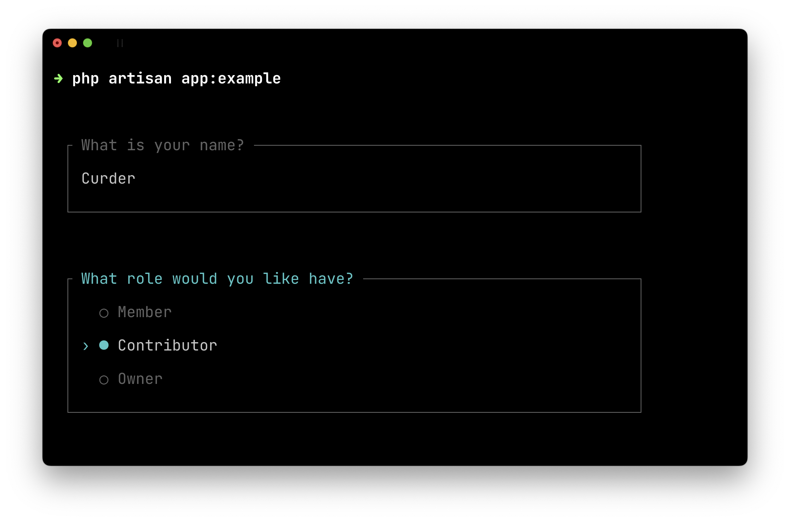
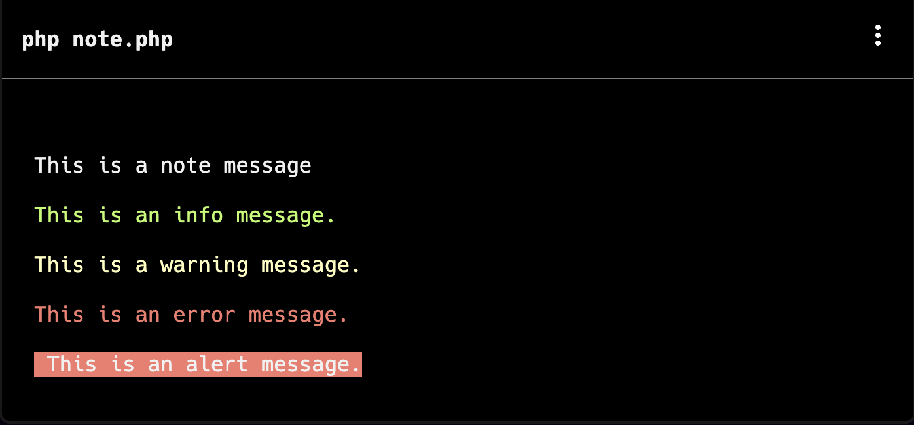
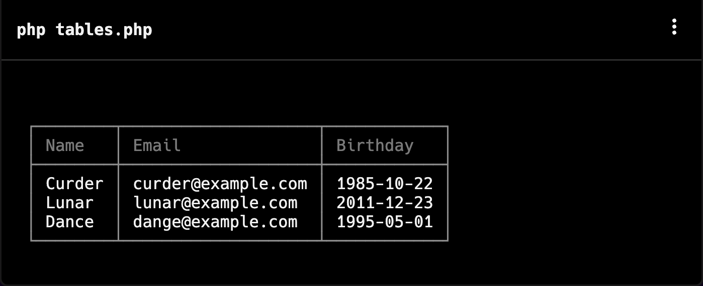
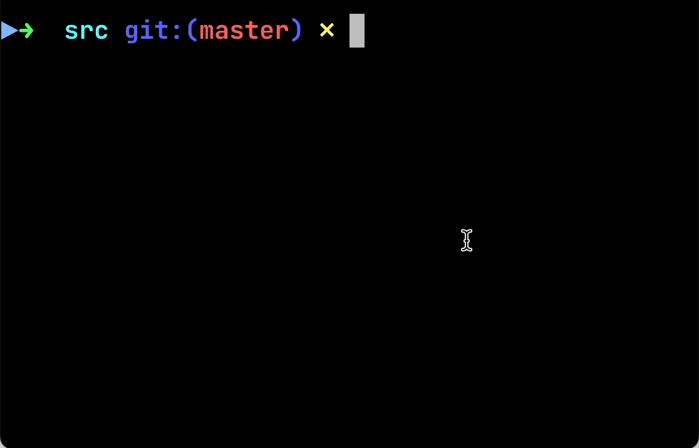
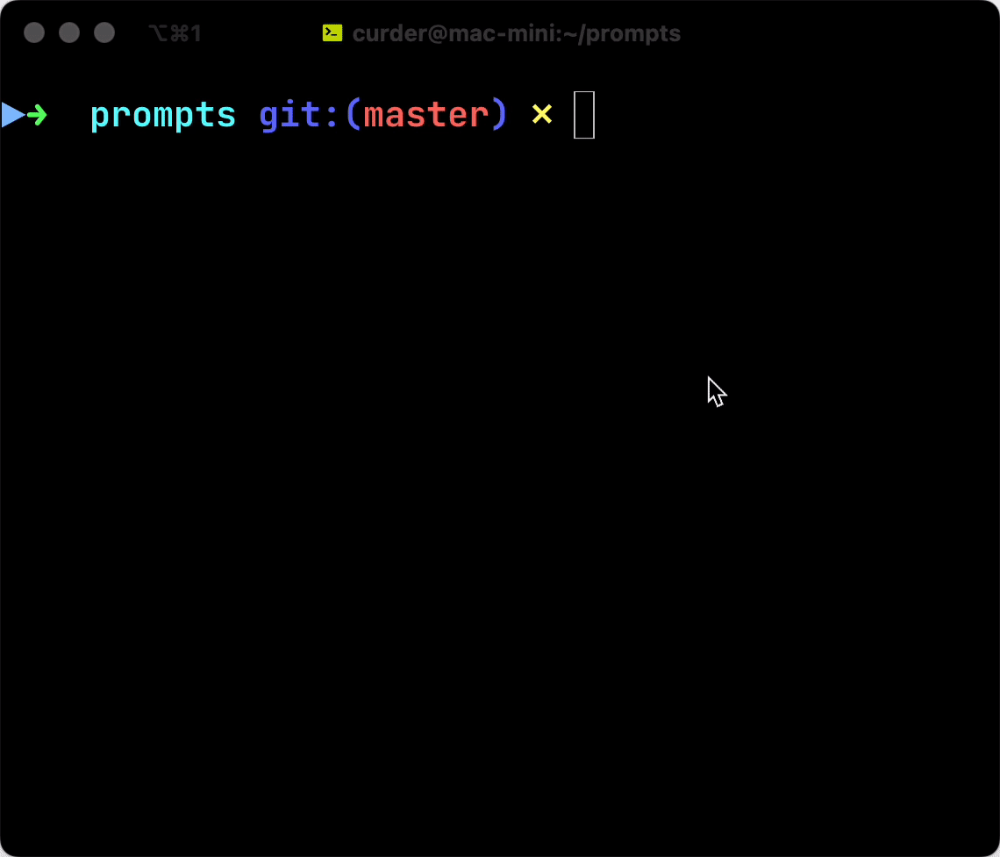

# laravel/prompts

[Laravel Prompts](https://github.com/laravel/prompts) 是一个 PHP 包，用于向命令行应用程序添加美观且用户友好的表单，具有类似浏览器的功能，包括占位符文本和验证。

下图是来自 [官方文档的 Laravel Prompts](https://laravel.com/docs/master/prompts) 预览图。



## 安装

Laravel Prompts 可以使用 Composer 包管理器安装在其他 PHP 项目中（最新的 Laravel 项目已包含）：

```bash
composer require laravel/prompts
```

## 输入类型

Laravel Prompts 当前支持在表单中常见的输入类型，例如：

- 文本 `text()`
- 密码 `password()`
- 确认 `confirm()`
- 选择 `select()`
- 多选 `multiselect()`
- 建议 `suggest()`
- 搜索 `search()`
- 多搜索 `multisearch()`
- 暂停 `pause()`


### 文本 Text


| 参数名           | 参数类型     | 是否必须 | 默认值    | 说明                         |
|---------------|:---------|:-----|:-------|----------------------------|
| `label`       | `string` | 是    | —      | 字段的名称                      |
| `placeholder` | `string` | 否    | `''`   | 输入框里面的提示文本                 |
| `default`     | `string` | 否    | `''`   | 字段的默认值                     |
| `required`    | `bool`   | 否    | `''`   | 是否必须，如果传递的是字符串，则在数据验证失败后展示 |
| `validate`    | `mixed`  | 否    | `null` | 数据验证规则                     |
| `hint`        | `string` | 否    | `''`   | 输入框下方的字段提示                 |


#### 简单用法 `label`

最简单的 `text()` 用法是仅提供 `label` 参数。

然后在命令行终端运行它，并在输入框中根据提示输入信息，可以看到通过变量获取到了用户的输入。

::: code-group

```php [基础用法]
use function Laravel\Prompts\text;

$name = text(label: 'What is your name?');

echo "Hello, {$name}!\n";
```

```text [执行预览]
➜ php text.php

 ┌ What is your name? ──────────────────────────────────────────┐
 │ Curder                                                       │
 └──────────────────────────────────────────────────────────────┘

 Hello, Curder!
```
:::


#### 占位符 `placeholder`


可以提供 `placeholder` 参数，用于在用户输入之前对用户进行提示。

::: code-group
```php [placeholder 参数]
text(
    label: 'What is your name?', 
    placeholder: "E.g. John Doe" // [!code ++]
);
```

```text [执行预览]
➜ php text.php

 ┌ What is your name? ──────────────────────────────────────────┐
 │                                                              │ // [!code --]
 │ Eg: John Doe                                                 │ // [!code ++]
 └──────────────────────────────────────────────────────────────┘
```
:::


#### 默认值 `default`

如果需要提供默认值的话，可以使用 `default` 参数对默认值进行设定。

::: code-group

```php [default 参数]
text(
    label: 'What is your name?',
    default: 'Petty' // [!code ++]
);
```

```text [执行预览]
➜ php text.php

 ┌ What is your name? ──────────────────────────────────────────┐
 │                                                              │ // [!code --]
 │ Petty                                                        │ // [!code ++]
 └──────────────────────────────────────────────────────────────┘
```
:::


#### 信息提示 `hint`

如果需要更加详细的说明，可以通过 `hint` 参数自定义信息提示，它会出现在输入框下方。

::: code-group

```php [hint 参数]
text(
    label: 'What is your name?',
    hint: 'This will be displayed on your profile.' // [!code ++]
);
```

```text [执行预览]
➜ php text.php

 ┌ What is your name? ──────────────────────────────────────────┐
 │                                                              │
 └──────────────────────────────────────────────────────────────┘
  This will be displayed on your profile. // [!code ++]
```
:::


#### 是否必填 `required`

如果输入框内容必须提供的话，可以通过传入 `required` 参数为 `true` 的方式。

::: code-group
```php [required 参数（布尔值）]
text(
    label: 'What is your name?',
    required: true, // [!code ++]
);
```

```text [执行预览]
# 当用户未输入任何字符，点击回车则会提示必须填写当前字段
➜ php text.php

 ┌ What is your name? ──────────────────────────────────────────┐
 │                                                              │
 └──────────────────────────────────────────────────────────────┘
  ⚠ Required. // [!code ++]

```
:::


如果需要自定义验证消息，也还可以传递一个字符串：

::: code-group

```php [required 参数（字符串）]
text(
    label: 'What is your name?',
    required: 'Your name is required.', // [!code ++]
);
```

```text [执行预览]
# 当用户未输入任何字符，点击回车则会提示必须填写当前字段
➜ php text.php

 ┌ What is your name? ──────────────────────────────────────────┐
 │                                                              │
 └──────────────────────────────────────────────────────────────┘
  ⚠ Your name is required. // [!code ++]
```
:::


#### 自定义验证 `validate`

除了必须填写的情况外，如果需要执行额外的验证逻辑，可以将闭包传递给 `validate` 参数。

::: code-group

```php [PHP 项目]
text(
    label: 'What is your name?',
    validate: fn (string $value) => match (true) { // [!code ++]
        strlen($value) < 3 => 'The name must be at least 3 characters.', // [!code ++]
        strlen($value) > 10 => 'The name must not exceed 10 characters.', // [!code ++]
        default => null // [!code ++]
    }
);
```

```php [Laravel 项目]
text(
    label: 'What is your name?',
    validate: [ // [!code ++]
        'name' => ['required', 'min:3', 'max:10', 'unique:users,name'] // [!code ++]
    ] // [!code ++]
);
```
:::

`validate` 闭包将接收已输入的值，如果返回字符串则提示错误消息，如果返回 `null` 则表示验证通过。

> [!TIP] Laravel 项目提示
> 如果在 Laravel 项目中使用的话，可以直接传递[强大的验证器](https://laravel.com/docs/11.x/validation) 对用户输入进行验证，可以提供一个包含属性名称和参数所需验证规则的数组。


### 密码 Password

`password()` 的功能与 `text()` 文本输入框函数类似，但用户在控制台中输入的输入将被屏蔽。

当询问密码等敏感信息时，这很有用。

```php
use function Laravel\Prompts\password;
 
$password = password('What is your password?');
```

包含占位符文本、信息提示和必须值：

```php
password(
    label: 'What is your password?',
    placeholder: 'password', // 占位符
    hint: 'Minimum 8 characters.', // 信息提示
    // required: true., // 所需值
    required: 'The password is required.',
);
```

#### 自定义验证 validate

除了必须填写的情况外，如果需要执行额外的验证逻辑，可以将闭包传递给 `validate` 参数。

::: code-group

```php [PHP 项目]
password(
    label: 'What is your password?',
    validate: fn (string $value) => match (true) { // [!code ++]
        strlen($value) < 8 => 'The password must be at least 8 characters.', // [!code ++]
        default => null // [!code ++]
    } // [!code ++]
);
```

```php [Laravel 项目]
use Illuminate\Validation\Rules\Password;

password(
    label: 'What is your password?',
    validate: [ // [!code ++]
        'password' => [ // [!code ++]
            'required', // [!code ++]
            Password::min(8)->max(16)->letters()->numbers()->symbols(), // [!code ++]
        ] // [!code ++]
    ] // [!code ++]
);
```
:::

`validate` 闭包将接收已输入的值，如果返回字符串则提示错误消息，如果返回 `null` 则表示验证通过。

> [!TIP] Laravel 项目提示
> 如果在 Laravel 项目中使用的话，可以直接传递[强大的验证器](https://laravel.com/docs/11.x/validation) 对用户输入进行验证，可以提供一个包含属性名称和参数所需验证规则的数组。


### 确认 Confirm


如果需要询问用户"是/否"的确认，可以使用 `confirm()` 功能。

用户可以使用上、下键或按`y` / `n` 选择对应的响应。

该 `confirm()` 函数将返回 `true` 或 `false`。

```php
use function Laravel\Prompts\confirm;
 
confirm('Do you accept the terms?');
```

可以给 `confirm()` 方法传入默认值、自定义 `yes`、`no` 的标签、是否必须以及提示信息。

```php
confirm(
    label: 'Do you accept the terms?',
    default: false, // 默认为 false
    yes: 'OK',
    no: 'Cancel',
    // required: true,
    required: "You must accept the terms to continue.", // 是否必须
    hint: 'The terms must be accepted to continue.' // 提示信息
);
```


### 选择 Select

如果需要用户从一组预定义的选项中进行选择，可以使用 `select()` 函数：

```php
use function Laravel\Prompts\select;
 
select(
    label: 'What role should the user have?',
    // options: ['Member', 'Contributor', 'Owner'],
    options: [ // 自定义关联数组，使用键作为返回的值 
        'member' => 'Member',
        'contributor' => 'Contributor',
        'owner' => 'Owner'
    ],
);
```

也可以指定默认选择、超出数量开始滚动、信息提示和是否必须：

```php
$role = select(
    label: 'What role should the user have?',
    options: ['Member', 'Contributor', 'Owner'],
    default: 'Owner', // 默认值
    scroll: 2, // 超过的数量开始滚动
    hint: 'The role may be changed at any time.', // 提示信息
    // required: true, // 是否必须
);
```

`required` 参数仅支持 `true` 或字符串。

#### 自定义验证 validate

如果需要提供一个选项但阻止它被选择，可以向 `validate` 参数传递一个闭包来自定义验证逻辑：

::: code-group
```php [PHP 项目]
select(
    label: 'What role should the user have?',
    options: [
        'member' => 'Member',
        'contributor' => 'Contributor',
        'owner' => 'Owner'
    ],
    validate: fn (string $value) => $value === 'owner' ? 'An owner already exists.' : null,
);
```

```php [Laravel 项目]
use App\Models\User;

select(
    label: 'What role should the user have?',
    options: [
        'member' => 'Member',
        'contributor' => 'Contributor',
        'owner' => 'Owner'
    ],
    validate: fn (string $value) =>
        $value === 'owner' && User::where('role', 'owner')->exists()
            ? 'An owner already exists.'
            : null
);
```
:::

如果 `options` 参数是关联数组，则闭包将接收选定的键，否则它将接收选定的值。

闭包可能会返回错误消息，如果返回 `null` 则表示验证通过。

### 多选 Multiselect

如果需要用户能够选择多个选项，可以使用 `multiselect` 功能：

```php
use function Laravel\Prompts\multiselect;
 
multiselect(
    'What permissions should be assigned?',
    ['Read', 'Create', 'Update', 'Delete']
);
```

也可以指定默认选择 `default`、超出数量开始滚动`scroll`、默认值 `required`、自定义验证 `validate` 和信息提示 `hint` 参数：

```php
multiselect(
    label: 'What permissions should be assigned?',
//    options: ['Read', 'Create', 'Update', 'Delete'],
    options: [ // 自定义关联数组，使用键作为返回的值
        'read' => 'Read',
        'create' => 'Create',
        'update' => 'Update',
        'delete' => 'Delete'
    ],
    default: ['Read', 'Create'],
    scroll: 3,
    // required: true,
    required: 'All users require permission.',
    validate: fn(array $values) => !in_array('read', $values)
        ? 'All users require the read permission.'
        : null,
    hint: 'Permissions may be updated at any time.'
);
```

如果 `options` 参数是关联数组，则闭包将接收选定的键，否则它将接收选定的值。

闭包可能会返回错误消息，如果返回 `null` 则表示验证通过。

### 建议 Suggest

`suggest()` 函数可用于为用户的输入提供自动完成功能。

**无论自动完成提示如何，用户仍然可以提供任何答案：**

```php
use function Laravel\Prompts\suggest;
 
suggest(
    label: 'What is your name?',
    options: ['John', 'Doe', 'Kitty'],
);
```

`options` 参数也可以支持闭包，当用户每次键入输入字符时都会调用该闭包。

闭包将接受一个包含用户到目前为止输入的字符串参数，并返回一个用于自动完成的选项数组：

```php
suggest(
    label: 'What is your name?',
    options: fn ($value) => collect(['John', 'Doe', 'Kitty'])
        ->filter(fn ($name) => Str::contains($name, $value, ignoreCase: true))
);
```

同时也可以提供占位符 `placeholder`、默认值`default`、超出数量开始滚动 `scroll`、是否必填 `required` 自定义验证 `validate` 和信息提示 `hint`。


```php
suggest(
    label: 'What is your name?',
    options: ['Taylor', 'Dayle'],
    placeholder: 'E.g. Taylor',
    default: $user?->name,
    scroll: 2, 
    // required: true,
    required: 'Your name is required.',
        validate: fn (string $value) => match (true) {
        strlen($value) < 3 => 'The name must be at least 3 characters.',
        strlen($value) > 255 => 'The name must not exceed 255 characters.',
        default => null
    },
    hint: 'This will be displayed on your profile.'
);
```

#### 自定义验证 `validate`

::: code-group

```php [PHP 项目]
suggest(
    label: 'What is your name?',
    options: ['Taylor', 'Dayle'],
    validate: fn (string $value) => match (true) { // [!code ++]
        strlen($value) < 3 => 'The name must be at least 3 characters.', // [!code ++]
        strlen($value) > 255 => 'The name must not exceed 255 characters.', // [!code ++]
        default => null, // [!code ++]
    }, // [!code ++]
);
```

```php [Laravel 项目]
suggest(
    label: 'What is your name?',
    options: ['Taylor', 'Dayle'],
    validate: [ // [!code ++]
        'name' => ['required', 'min:3', 'max:255'] // [!code ++]
    ] // [!code ++]
);
```
:::

`validate` 闭包将接收已输入的值，如果返回字符串则提示错误消息，如果返回 `null` 则表示验证通过。


### 搜索 Search

当有很多选项供用户选择时，可以使用 `search()` 功能允许用户在使用箭头键选择选项之前键入搜索查询来过滤结果：

```php
use function Laravel\Prompts\search;
 
function filter(string $value): array
{
    $data = [1 => 'John Doe', 2 => 'Jane Smith', 3 => 'Bob Johnson'];

    return strlen($value) > 0
        ? array_filter($data, fn(string $item) => stripos($item, $value) !== false)
        : [];
}

search(
    label: 'Search for the user that should receive the mail',
    options: filter(...),
);
```

`options` 闭包将接收用户迄今为止输入的文本，并且必须返回一个选项数组。

如果返回关联数组，则将返回所选选项的键，否则将返回其值。


同时也可以提供占位符 `placeholder`、超出数量开始滚动 `scroll`、自定义验证 `validate`、信息提示 `hint`和是否必填 `required`。

```php
search(
    label: 'Search for the user that should receive the mail',
    options: filter(...),
    placeholder: 'E.g. John',
    scroll: 2,
    validate: function (int|string $value) {
        if ($value === 1) {
            return 'Invalid user';
        }
    },
    hint: 'The user will receive an email immediately.',
    required: "You must search a user"
);
```

如果 `options` 闭包返回关联数组，则 `validate` 闭包将接收选定的键，否则它将接收选定的值。

`validate` 闭包将接收已输入的值，如果返回字符串则提示错误消息，如果返回 null 则表示验证通过。


### 多搜索 Multisearch


如果有很多可搜索选项并且需要用户能够选择多个项目，可以使用 `multisearch()` 功能允许用户在使用箭头键和空格键选择选项之前键入搜索查询来过滤结果：

```php
use function Laravel\Prompts\multisearch;

multisearch( // [!code focus]
    label: 'Search for the users that should receive the mail', // [!code focus]
    options: filter(...), // [!code focus]
); // [!code focus]

function items(): array
{
    return [1 => 'John Doe', 2 => 'Jane Smith', 3 => 'Bob Johnson'];
}

function filter(string $value): array
{

    return strlen($value) > 0
        ? array_filter(items(), fn(string $item) => stripos($item, $value) !== false)
        : [];
}
```

`options` 闭包将接收用户输入的文本，并且必须返回一个选项数组。

如果返回关联数组则将返回所选选项的键，否则将返回它们的值。

同时也可以提供占位符 `placeholder`、超出数量开始滚动 `scroll`、自定义验证 `validate`、信息提示 `hint` 和是否必填 `required`。

```php
multisearch(
    label: 'Search for the users that should receive the mail',
    options: filter(...),
    placeholder: 'E.g. John',
    scroll: 2,
//    required: true,
    required: 'You must select at least one user.',
    validate: function (array $values) {
        if ($intersects = array_intersect($values, [1, 2])) {
            $selected = array_filter(
                array: items(),
                callback: fn(string $item): bool => in_array($item, $intersects),
                mode: ARRAY_FILTER_USE_KEY
            );
            return implode(',', $selected) . ' is disabled now';
        }
    },
    hint: 'This will be displayed on your profile.',
);

function items(): array
{
    return [1 => 'John Doe', 2 => 'Jane Smith', 3 => 'Bob Johnson'];
}

function filter(string $value): array
{

    return strlen($value) > 0
        ? array_filter(items(), fn(string $item) => stripos($item, $value) !== false)
        : [];
}
```

如果 `options` 闭包返回关联数组，则 `validate` 闭包将接收选定的键，否则它将接收选定的值。

`validate` 闭包将接收已输入的值，如果返回字符串则提示错误消息，如果返回 `null` 则表示验证通过。


### 暂停 Pause

`pause()` 函数可用于向用户显示信息文本，并等待用户通过按 `Enter` / `Return` 键确认其希望继续。

::: code-group
```php [用法]
use function Laravel\Prompts\pause;
 
pause('Press ENTER to continue.');
```

```text [执行预览]
➜ php pause.php

 Press ENTER to continue.
```
:::


## 输出类型

### 消息 Note

使用 `note`、`info`、`warning`、`error` 和 `alert` 函数可用于显示信息性消息：

```php
use function Laravel\Prompts\{alert, error, info, note, warning};

note(message: 'This is a note message');

info(message: 'This is an info message.');

warning(message: 'This is a warning message.');

error(message: 'This is an error message.');

alert(message: 'This is an alert message.');
```

::: details 点击查看运行预览，来自 [wrap](https://app.warp.dev/block/ZxBPjHlT4LflSaWW1DP6lt) 终端的运行结果。

:::

### 表格 Table

使用 `table()` 可以轻松显示多行和多列数据。参数分别是提供表的列名称和数据：

```php
use function Laravel\Prompts\table;

table(
    headers: ['Name', 'Email', 'Birthday'],
    rows: [
        ['Curder', 'curder@example.com', '1985-10-22'],
        ['Lunar', 'lunar@example.com', '2011-12-23'],
        ['Dance', 'dange@example.com', '1995-05-01'],
    ]
);
```

::: details 下面是运行预览，来自 [wrap](https://app.warp.dev/block/LSGNitm8Io7v6xdpJvUIX4) 终端的运行结果。

:::


### 转动 Spin

`spin()` 函数在执行指定的回调时显示一个加载中状态和一条可选消息。

它用于指示正在进行的进程并在完成时返回回调的结果：

```php
use function Laravel\Prompts\spin;

spin(callback: function () {
    sleep(mt_rand(1, 3)); // 模拟一些耗时的操作
    return 'Hello world';
}, message: 'please wait a few seconds...');
```

::: details 点击预览执行结果

:::


### 进度条 Progress

`progress()` 函数将显示一个进度条，并在给定的可迭代值上推进每次迭代的进度。

这对于长时间运行的任务，显示进度条以告知用户任务的完成程度会很有帮助。

```php
use function Laravel\Prompts\{info, progress};

function items(): array
{
    return [
        ['id' => 1, 'name' => 'John Doe'],
        ['id' => 2, 'name' => 'Jane Smith'],
        ['id' => 3, 'name' => 'Bob Johnson'],
    ];
}

$progress = progress(
    label: 'Updating users',
    steps: items(),
    callback: function (array $item, $progress) {
        sleep(mt_rand(1, 3));
        $progress
            ->label("Updating {$item['name']}")
            ->hint("Updating user id is :{$item['id']}");

        return $item;
    },
    hint: 'This may take some time.',
);

info('Update user success');
```

`callback` 回调还可以接受`\Laravel\Prompts\Progress` 实例，允许在回调内部修改每次迭代的标签和提示。

有时可能需要更多地手动控制进度条的运行方式。首先，定义流程将迭代的步骤总数。然后，处理完每一项后调用 `advance()` 方法直增进度条：

```php
<?php
use function Laravel\Prompts\{info, progress};

function items(): array
{
    return [
        ['id' => 1, 'name' => 'John Doe'],
        ['id' => 2, 'name' => 'Jane Smith'],
        ['id' => 3, 'name' => 'Bob Johnson'],
    ];
}

$progress = progress(
    label: 'Updating users',
    steps: items(),
    hint: 'This may take some time.',
);

// Start the progress bar.
$progress->start();

foreach (items() as $item) {
    $progress
        ->label("Updating {$item['name']}")
        ->hint("Updating user id is :{$item['id']}");

    // your business logic.
    // ...
    sleep(mt_rand(1, 3));

    $progress->advance();
}

$progress->finish();

info('Update user success');
```

:::::: details 点击查看预览结果

:::
