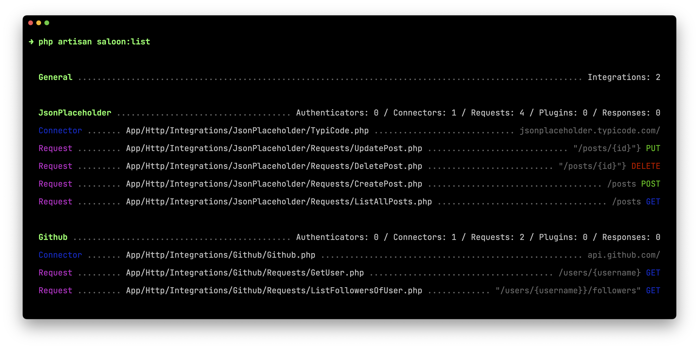

# `saloonphp/laravel-plugin`

使用 Saloon 可以构建优雅的 API 请求。Saloon 将 API 请求移至可重用的类中，以便可以将所有 API 配置保存在一个位置。

下面是通过 `saloon:list` 的命令查看已经集成到项目的增、删、改、查资源：



## 安装

使用 Composer 命令将插件安装到项目：

```bash
composer require saloonphp/laravel-plugin
```

使用下面的 artisan 命令可以发布配置文件：

```bash
php artisan vendor:publish --tag=saloon-config
```

一些由 Saloon 提供的可用命令：

| 命令                             | 描述                 |
|--------------------------------|--------------------|
| `php artisan saloon:connector` | 创建新的连接器            |
| `php artisan saloon:request`   | 创建新的请求             |
| `php artisan saloon:response`  | 创建自定义响应            |
| `php artisan saloon:plugin`    | 创建一个处理请求的插件        |
| `php artisan saloon:auth`      | 创建一个自定义的授权插件       |
| `php artisan saloon:list`      | 查看当前已有 Saloon 集成数据 |

## 连接器 connector

连接器用于定义 API 集成属性（例如 URL 和标头）的类。将关联的每个请求上使用的任何行为（例如身份验证）都在连接器中进行定义。

```bash
php artisan saloon:connector
```

分别输入连接器存放的目录和连接器的名称。比如连接器目录输入 `JsonPlaceholder`并将类命名为 `TypiCodeConnector`，则定义的文件被存放到 `App\Http\Integrations\JsonPlaceholder\TypiCodeConnector.php`。

### Api 前缀

通过连接器文件的 `resolveBaseUrl()` 方法返回对应字符串即可：

```php
public function resolveBaseUrl(): string
{
    return 'https://jsonplaceholder.typicode.com/'; // [!code ++]
}
```

### 请求头

大多数 API 集成都会有所有请求使用的通用标头。可以在连接器文件的 `defaultHeader()` 方法中定义。

```php
protected function defaultHeaders(): array
{
    return [
        'Content-Type' => 'application/json',
        'Accept' => 'application/json',
    ];
}
```

也可以在连接器实例上使用 `headers()` 方法动态设置。

```php
use App\Http\Integrations\JsonPlaceholder\TypiCodeConnector;

$typicode = new TypiCodeConnector

$typicode->headers()->add('Content-Type', 'application/json');
```

### 超时时间 timeout

默认情况 Saloon 的连接超时时间为 10 秒，请求超时时间为 30 秒。

可以通过使用 `HasTimeout` 特征并指定 `connectTimeout` 和 `requestTimeout` 属性来自定义它。

```php
<?php

namespace App\Http\Integrations\JsonPlaceholder;

use Saloon\Traits\Plugins\HasTimeout;

class TypiCodeConnector extends Connector
{
    use HasTimeout;

    protected int $connectTimeout = 30;

    protected int $requestTimeout = 60;

    // ...
}
```

### 构造函数参数

如果需要在不同连接器实例中传递不同的参数，可以尝试定义一个构造函数传递属性，例如，如果应用程序的每个用户的 URL 发生变化，您可以将其定义为构造函数参数。

```php
class TypiCodeConnector extends Connector
{
    public function __construct(protected readonly string $baseUrl) {
        //
    }

    public function resolveBaseUrl(): string
    {
        return $this->baseUrl;
    }
}
```

然后可以这样使用构造器：

```php
$connector = new TypiCodeConnector('https://jsonplaceholder.typicode.com/');
```

### HTTP 客户端配置

连接器使用 HTTP 客户端发送请求。默认情况下，此客户端是 [Guzzle](https://github.com/guzzle/guzzle)。

如果需要自定义 Guzzle 配置选项，那么可以扩展 `defaultConfig` 方法。

也可以[点击此处查看 Guzzle 提供的可用选项列表](https://docs.guzzlephp.org/en/stable/request-options.html)

```php
class TypiCodeConnector extends Connector
{
    // ...

    public function defaultConfig(): array
    {
        return [
            'allow_redirects' => true,
        ];
    }
}
```

跟请求头的配置一样，也可以在实例中动态配置它：

```php
$connector = new TypiCodeConnector;

$connector->config()->add('allow_redirects', true);
```

## 请求 request
