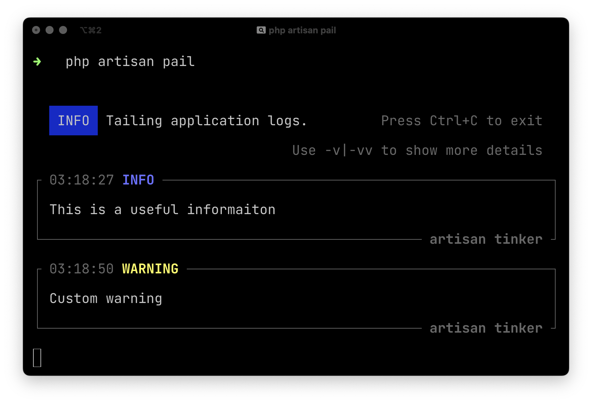

# laravel/pail

[Laravel Pail](https://github.com/laravel/pail) 是一个 Laravel 官方扩展包，可以轻松深入了解应用程序的日志文件。

与标准的 tail 命令不同，Pail 旨在与任何日志驱动程序一起使用，非常容易记住 ，并提供一组有用的过滤器来帮助快速找到所需的内容。


## 安装 Laravel Pail

使用 Composer 命令安装它：

```bash
composer require laravel/pail
```

## 使用

然后使用下面的命令，开始跟踪日志：

```bash
php artisan pail
```



上面是基本的使用方式，同时 Laravel Pail 有一些标志允许以有用的方式过滤日志消息。


### 按异常类型过滤日志


```bash
php artisan pail --filter="QueryException"
```

### 按内容过滤

```bash
php artisan pail --message="User created"
```

### 按日志级别过滤

```bash
php artisan pail --level=error
```

可以使用任何级别：
- `emergency` 紧急
- `alert` 警报
- `critical` 严重
- `error` 错误
- `warning` 警告
- `notice` 通知
- `info` 信息 
- `debug` 调试


### 按用户 ID 过滤

```bash
php artisan pail --user=1
```