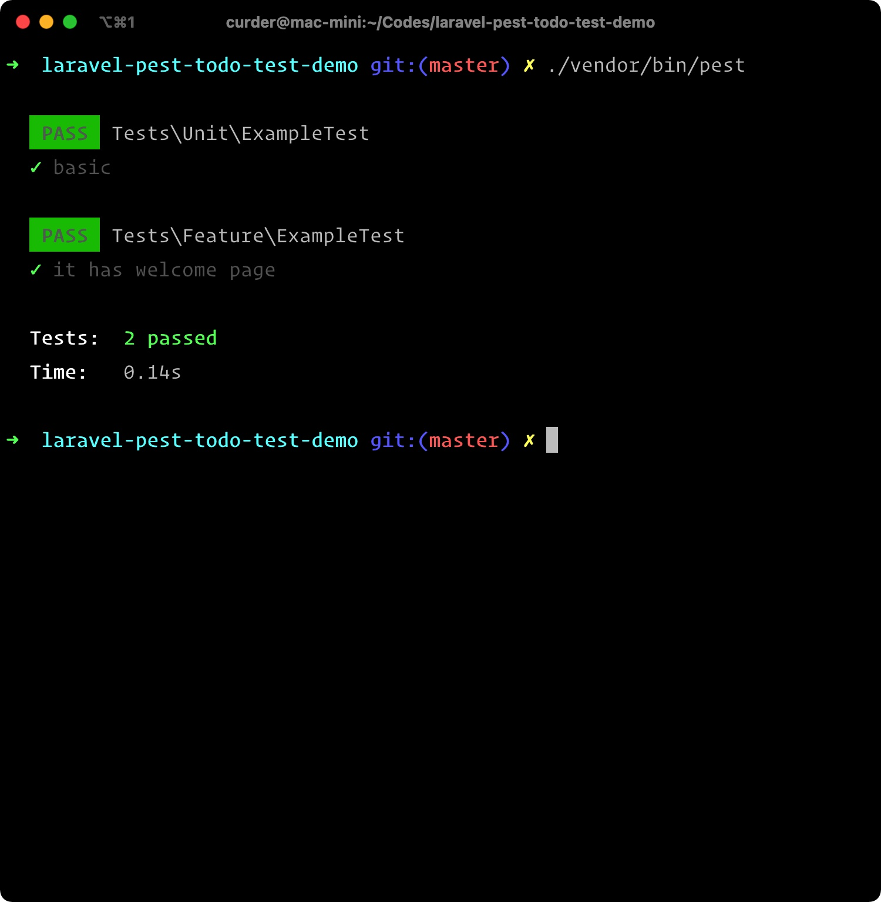
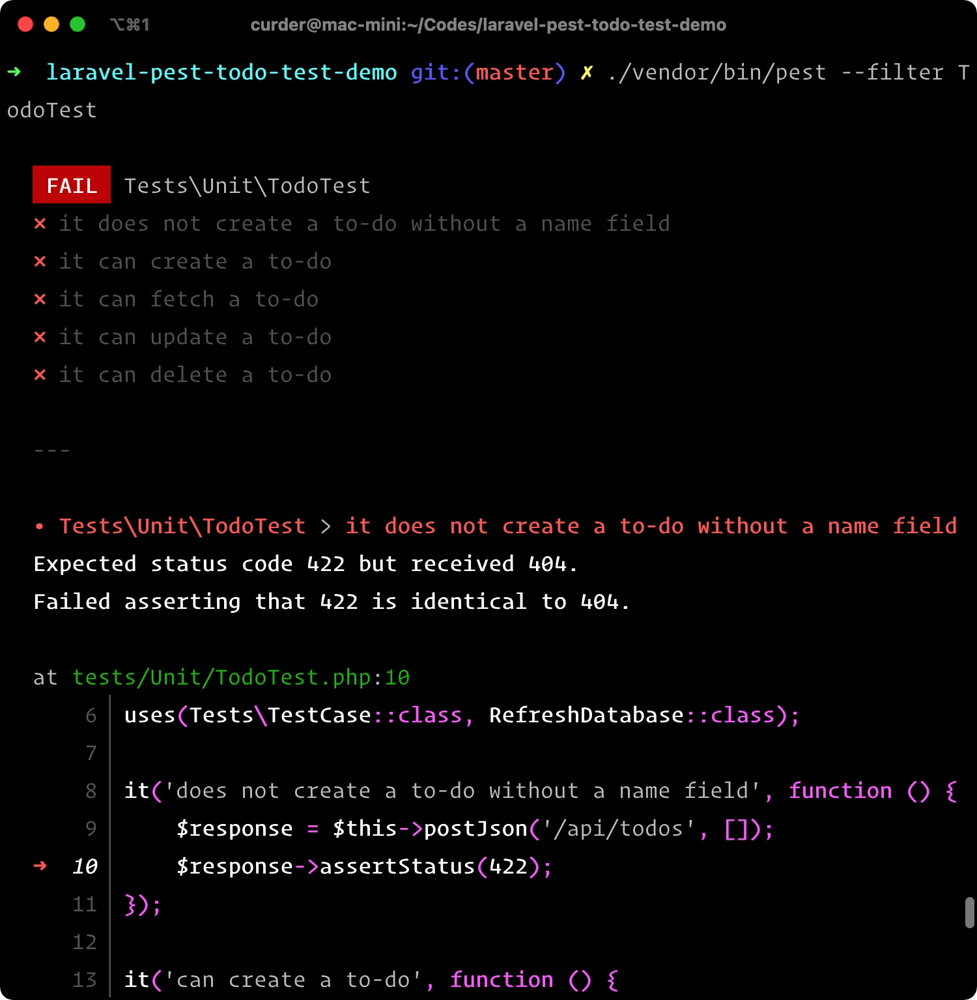

# 使用 pest 测试 Laravel API

[Pest](https://pestphp.com/) 是 [Nuno Maduro](https://twitter.com/enunomaduro) 开发的一个新的测试PHP框架。

虽然 Pest 本身是建立在流行的PHP测试框架 PHPUnit 之上，但 Pest 旨在为编写测试提供更好的体验，哲学很简单。

通过提供富有表现力的界面，使 TDD 体验简单而优雅。

在本文中了解如何在 Laravel 项目中开始使用 Pest 。

使用测试驱动的方法，将构建一个简单的 `todos` 待办应用程序，可以创建、编辑、更新和删除任务。

## 技术要求

- PHP 7.3 或更高版本。Pest 需要 PHP 7.3+ 才能运行。
- [Laravel 8](https://laravel.com/docs/master/installation)
- [Composer](https://getcomposer.org/)
- 对 [PHPUnit](https://phpunit.readthedocs.io/en/9.0/index.html) 的基本了解
- 对 SQLite 基本了解，本文将使用 SQLite，因为它可以更快地运行测试。

## 安装 Laravel

设置新的 Laravel 项目有多种方法，可以通过 Laravel 安装程序或使用 Composer 进行操作，这里使用 Composer 。

在终端中运行以下命令：

```bash
composer create-project --prefer-dist laravel/laravel:^8.0 laravel-pest-todo-test-demo
```

这将在 `laravel-pest-todo-test-demo` 目录中为我们建立一个新的 Laravel 8 的项目。

## 安装 Pest

现在已经建立了一个新的 Laravel 8 项目，还需要执行几个额外的步骤来与 Laravel 一起建立 [Pest](https://pestphp.com)。

进入 `laravel-pest-todo-test-demo` 目录，然后运行以下命令安装 [Laravel Pest插件](https://pestphp.com/docs/plugins/laravel/)。

```bash
cd laravel-pest-todo-test-demo

composer require --dev pestphp/pest-plugin-laravel
```

::: warning 注意
由于当前版本 `pestphp/pest-plugin-laravel@v1.0.0` 对 phpunit 的版本要求 `"phpunit/phpunit": ">= 9.3.7 <= 9.5.3"`，可以通过 [composer.json](https://github.com/pestphp/pest/blob/master/composer.json#L26) 查看。
所以需要修改我们项目的 phpunit 版本，修改 `composer.json` 中 `"phpunit/phpunit": "9.5.3"`，指定 phpunit 的版本为：`9.5.3`。
:::

插件安装完成后，运行以下命令：

```bash
php artisan pest:install
```

将在项目目录 `tests` 目录中创建一个`Pest.php`文件。

该 `Pest.php` 文件被[自动加载](https://getcomposer.org/doc/01-basic-usage.md#autoloading) 。Laravel 附带了一些基于 PHPUnit 的示例测试文件。
让更改这些测试以改为使用 Pest 。转到 `tests/Future` 目录并查看 `ExampleTest.php` 文件。

```php
<?php

namespace Tests\Feature;

use Tests\TestCase;

class ExampleTest extends TestCase
{
    /**
     * A basic test example.
     *
     * @return void
     */
    public function testBasicTest()
    {
        $response = $this->get('/');
        $response->assertStatus(200);
    }
}
```

要将此测试迁移到相应的 Pest 实现，替换文件的内容：

```php
<?php

it('has welcome page')->get('/')->assertStatus(200);
```

将这个 `ExampleTest` 文件从大约20行代码减少到仅2行，同时测试了完全相同的事物并产生了相同的结果。

也就是说，它访问`/` 处的根 URL ，并断言返回了 HTTP 状态码 200。

Pest 提供了两种编写测试的功能 `test()` 和 `it()`。

这两个函数都将测试描述作为第一个参数，并将包含测试期望的闭包作为第二个参数。

同样，也将 `ExampleTest.php` 位于 `tests/Unit` 目录中的文件也使用Pest。

```php
<?php

test('basic')->assertTrue(true);
```

接下来，使用以下命令运行测试套件：

```bash
./vendor/bin/pest
```

如下图所示，所有测试均应通过。



## 创建待办事项模型，迁移和控制器

应用程序将有一个名为的模型 `Todo` 。Laravel 提供了一个方便的命令，用于一次性生成模型、迁移文件、控制器和模型工厂。

为此，请运行以下命令：

```bash
php artisan make:model Todo -mcf
```

接下来，将以下代码添加到迁移文件中的方法中：`database/migrations[TODAYSDATE]_create_todos_table.php`

```php{4,5}
Schema::create('todos', function (Blueprint $table) {
    $table->id();

    $table->string('name');
    $table->boolean('completed')->default(false);

    $table->timestamps();
});
```

每个待办任务将具有一个 `name` 属性以及一个布尔 `completed` 属性，其默认值为 `false`。接下来，`App/Models/Todo.php` 使用以下代码编辑文件：

```php{12}
<?php

namespace App\Models;

use Illuminate\Database\Eloquent\Factories\HasFactory;
use Illuminate\Database\Eloquent\Model;

class Todo extends Model
{
    use HasFactory;

    protected $fillable = ['name', 'completed'];
}
```

将模型的 `name` 和 `completed` 属性分配为 [允许填充](https://laravel.com/docs/master/eloquent#mass-assignment) 。

## 修改模型工厂

编辑 `database/factories/TodoFactory.php` 文件的 `definition()` 方法以返回类似于以下数组的数组：

```php{24-27}
<?php

namespace Database\Factories;

use App\Models\Todo;
use Illuminate\Database\Eloquent\Factories\Factory;

class TodoFactory extends Factory
{
    /**
     * The name of the factory's corresponding model.
     *
     * @var string
     */
    protected $model = Todo::class;

    /**
     * Define the model's default state.
     *
     * @return array
     */
    public function definition()
    {
        return [
            'name' => 'Deploy Twilio Verify to Live',
            'completed' => false
          ];
    }
}
```

该 `definition` 方法返回使用工厂创建模型时应应用的默认属性值集。


## 配置数据库

使用内存中的 `SQLite` 数据库进行测试。Laravel 已经提供了使用 SQLite 数据库进行测试的支持。

位于项目目录根目录下的 `phpunit.xml` 文件，并取消注释以下代码行：

```xml {24-25}
<?xml version="1.0" encoding="UTF-8"?>
<phpunit xmlns:xsi="http://www.w3.org/2001/XMLSchema-instance"
         xsi:noNamespaceSchemaLocation="./vendor/phpunit/phpunit/phpunit.xsd"
         bootstrap="vendor/autoload.php"
         colors="true"
>
    <testsuites>
        <testsuite name="Unit">
            <directory suffix="Test.php">./tests/Unit</directory>
        </testsuite>
        <testsuite name="Feature">
            <directory suffix="Test.php">./tests/Feature</directory>
        </testsuite>
    </testsuites>
    <coverage processUncoveredFiles="true">
        <include>
            <directory suffix=".php">./app</directory>
        </include>
    </coverage>
    <php>
        <server name="APP_ENV" value="testing"/>
        <server name="BCRYPT_ROUNDS" value="4"/>
        <server name="CACHE_DRIVER" value="array"/>
        <server name="DB_CONNECTION" value="sqlite"/>
        <server name="DB_DATABASE" value=":memory:"/>
        <server name="MAIL_MAILER" value="array"/>
        <server name="QUEUE_CONNECTION" value="sync"/>
        <server name="SESSION_DRIVER" value="array"/>
        <server name="TELESCOPE_ENABLED" value="false"/>
    </php>
</phpunit>
```

## 编写测试

既然已经完成了所有必要的前置设置和配置，就可以开始编写测试了。

这些测试必须具有正常运行的应用程序，并将提供相应的实现以确保所有测试均通过。

运行以下 Pest 命令以创建单元测试文件：

```bash
php artisan pest:test TodoTest --unit
```

这将 `TodoTest.php` 在 `tests/Unit` 目录中创建。用以下代码替换文件的代码：

```php
<?php

use App\Models\Todo;
use Illuminate\Foundation\Testing\RefreshDatabase;

uses(Tests\TestCase::class, RefreshDatabase::class);

it('does not create a to-do without a name field', function () {
    $response = $this->postJson('/api/todos', []);
    $response->assertStatus(422);
});

it('can create a to-do', function () {
    $attributes = Todo::factory()->raw();
    $response = $this->postJson('/api/todos', $attributes);
    $response->assertStatus(201)->assertJson(['message' => 'To-do has been created']);
    $this->assertDatabaseHas('todos', $attributes);
});

it('can fetch a to-do', function () {
    $todo = Todo::factory()->create();

    $response = $this->getJson("/api/todos/{$todo->id}");

    $data = [
        'message' => 'Retrieved To-do',
        'todo' => [
            'id' => $todo->id,
            'name' => $todo->name,
            'completed' => $todo->completed,
        ]
    ];

    $response->assertStatus(200)->assertJson($data);
});

it('can update a to-do', function () {
    $todo = Todo::factory()->create();
    $updatedTodo = ['name' => 'Updated To-do'];
    $response = $this->putJson("/api/todos/{$todo->id}", $updatedTodo);
    $response->assertStatus(200)->assertJson(['message' => 'To-do has been updated']);
    $this->assertDatabaseHas('todos', $updatedTodo);
});

it('can delete a to-do', function () {
    $todo = Todo::factory()->create();
    $response = $this->deleteJson("/api/todos/{$todo->id}");
    $response->assertStatus(200)->assertJson(['message' => 'To-do has been deleted']);
    $this->assertCount(0, Todo::all());
});
```

在文件的顶部，该 `uses()` 方法将 `TestCase` 类和 `RefreshDatabase` Trait 绑定到当前的测试文件。

该基类 `TestCase` 由 Laravel 提供，并提供了在测试时使用该框架的辅助方法。

该 `RefreshDatabase` 特征负责在每次测试后迁移和重置数据库，以使先前测试的数据不会干扰后续测试。

现在，回顾一下每个测试的功能：

>  Laravel 提供了多个帮助程序来测试JSON API及其响应。

> **it('does not create a to-do without a name field')**
> 
> 利用 `postJson` 方法向 `api/todos` 地址发送 POST 请求，并传递一个空数组参数。接下来断言，`assertStatus()` 返回响应中的方法确保应返回 HTTP 状态代码 422 。作用是确保名称字段必须提供。

> **it('can create a to-do')**
> 
>  使用 `POST` 方式在 `api/todos` 地址发出请求时创建待办事项。断言已返回 HTTP 状态代码 201 ，并且该数据库实际上包含使用该 `assertDatabase()` 方法的待办事项。

> **it('can fetch a to-do')**
> 
>  使用 `TodoFactory` 上的 `create()` 方法，可以创建待办任务并将其存储在数据库中。接下来断言返回的状态码为 200 。该 `assertJson()` 方法将响应转换为数组，并验证给定数组是否存在于应用程序将返回的 JSON 响应中。此测试检查是否可以使用 ID 提取特定的待办事项。

> **it('can update a to-do')**
> 
>  此测试确保可以更新待办事项，并且可以在数据库中找到更新后的任务。

> **it('can delete a to-do')**
> 
>  此测试确保可以删除待办事项，并验证数据库中包含的任务总数为零。

要运行测试，请运行以下命令：

```bash
./vendor/bin/pest --filter TodoTest
```

由于当前尚未实现任何功能，因此测试应该会失败。



## 生成待办事项应用程序

到目前为止已经编写的测试的相应实现。转到 `app/Http/Controllers` 控制器目录中的 `TodoController.php` 文件，然后将文件代码替换为以下代码：

```php
<?php

namespace App\Http\Controllers;

use App\Models\Todo;
use Illuminate\Http\Request;

class TodoController extends Controller
{
    public function create(Request $request)
    {
        $request->validate($this->rules());

        $todo = Todo::create($request->only(['name']));

        $data = [
            'message' => 'To-do has been created',
            'todo' => $this->mapTodoResponse($todo)
        ];

        return response()->json($data, 201);
    }

    public function show(Todo $todo)
    {
        $data = [
            'message' => 'Retrieved To-do',
            'todo' => $this->mapTodoResponse($todo)
        ];

        return response()->json($data);
    }

    public function update(Todo $todo, Request $request)
    {
        $request->validate($this->rules());

        $todo->update($request->only(['name']));
        $todo->refresh();

        $data = [
            'message' => 'To-do has been updated',
            'todo' => $this->mapTodoResponse($todo)
        ];

        return response()->json($data);
    }

    public function delete(Todo $todo)
    {
        $todo->delete();

        $data = [
            'message' => 'To-do has been deleted'
        ];

        return response()->json($data);
    }

    protected function rules()
    {
        return [
            'name' => 'required|string|min:4'
        ];
    }

    protected function mapTodoResponse($todo)
    {
        return [
            'id' => $todo->id,
            'name' => $todo->name,
            'completed' => $todo->completed
        ];
    }
}
```

> - `create()` 方法创建一个新的待办任务。
> - `show()` 方法根据其ID返回给定的任务。
> - `update()` 方法将更新待办任务。
> - `delete()` 方法删除给定的待办任务。

接下来，将以下路由添加到 `routes/api.php` 文件：

```php
<?php

use Illuminate\Support\Facades\Route;
use App\Http\Controllers\TodoController;

Route::get('/todos/{todo}', [TodoController::class, 'show']);
Route::post('/todos', [TodoController::class, 'create']);
Route::put('/todos/{todo}', [TodoController::class, 'update']);
Route::delete('/todos/{todo}', [TodoController::class, 'delete']);
```

现在已经为测试提供了所有相应的实现，可以返回运行测试，它们现在都应该通过了。使用以下命令再次运行测试：

```bash
./vendor/bin/pest --filter TodoTest
```


## 结论

在本文中，已经了解了如何使用 Pest 测试框架为 Laravel 应用程序编写单元测试。

本教程可以作为 Pest 入门以及对 Laravel 应用程序进行单元测试的理想指南。

包含此项目完整代码 [GitHub 仓库地址](https://github.com/curder/laravel-pest-todo-test-demo) 。


## 原文链接

- [How to Unit Test a Laravel API with the Pest Framework](https://www.twilio.com/blog/unit-test-laravel-api-pest-framework)
