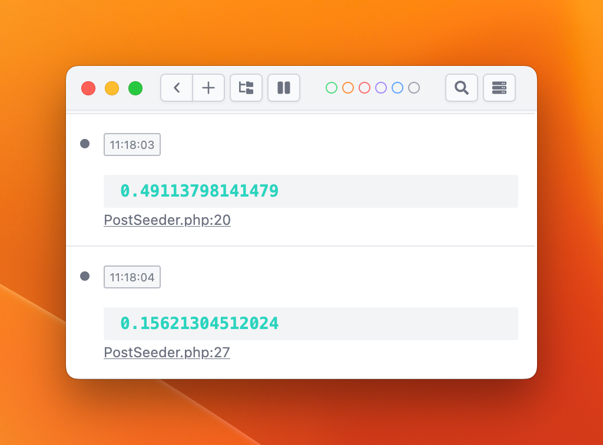

# 优化 Factory 数据库批量插入

在创建测试数据时，使用批量插入数据库记录，而不是在单独的插入每一行，因为这将使您的测试更快。

- :x:
    ```php
    Post::factory()->count(1000)->create();
    ```
  > 如果还在使用这种方式批量写入测试数据，建议采用下面的方式批量插入数据库记录。

- :white_check_mark:
    ```php
    Post::query()->insert(
        Post::factory()->count(1000)->make()->toArray()
    );
    ```

具体代码查看仓库地址[github.com/curder/laravel-tips](https://github.com/curder/laravel-tips/tree/optimize-factory-database-batch-insert)

## 执行速度对比

```php
// Before
$start = microtime(true);
Post::factory()->count(1000)->create();
ray(microtime(true) - $start); // 0.49113798141479

// After
$start = microtime(true);
Post::query()->insert(
    Post::factory()->count(1000)->make()->toArray()
);
ray(microtime(true) - $start); // 0.15621304512024
```

