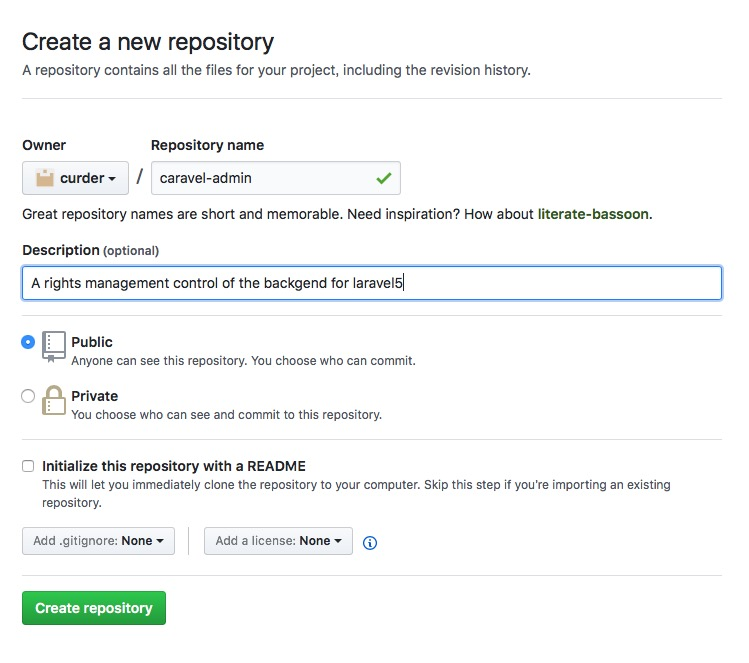
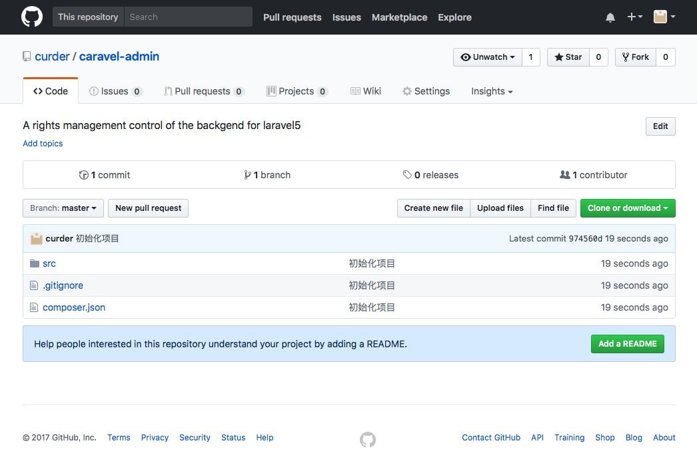
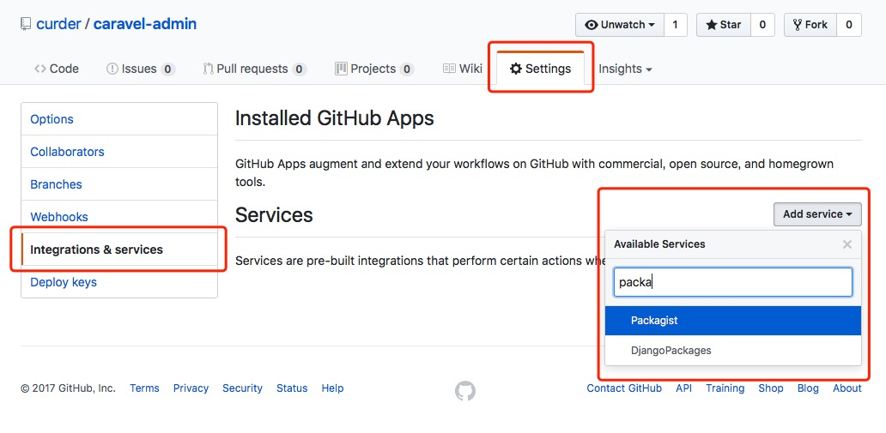
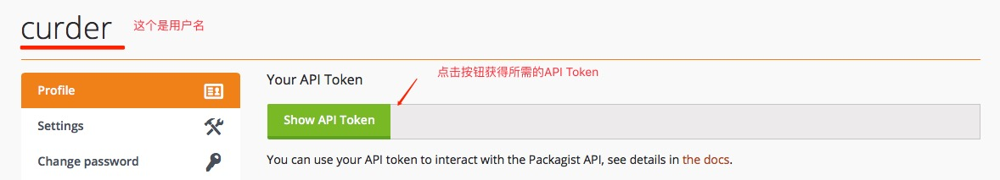
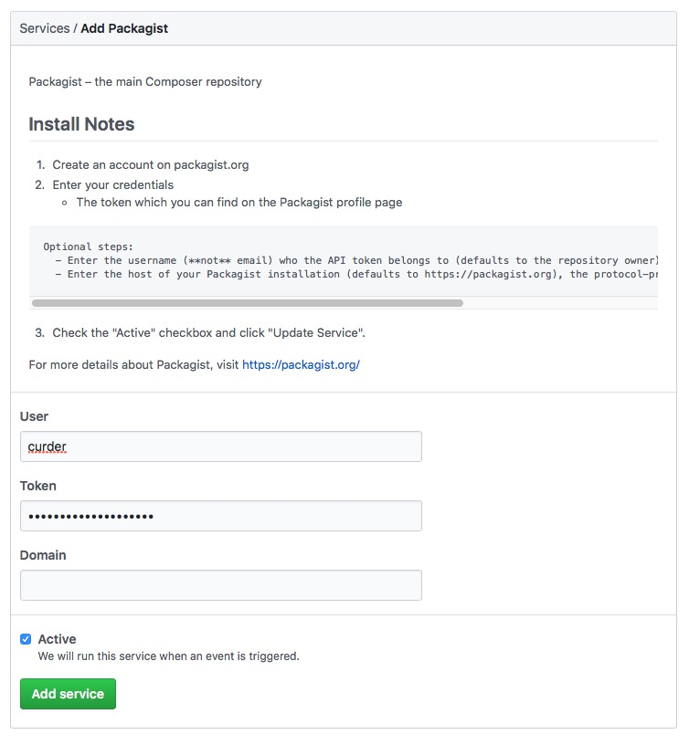
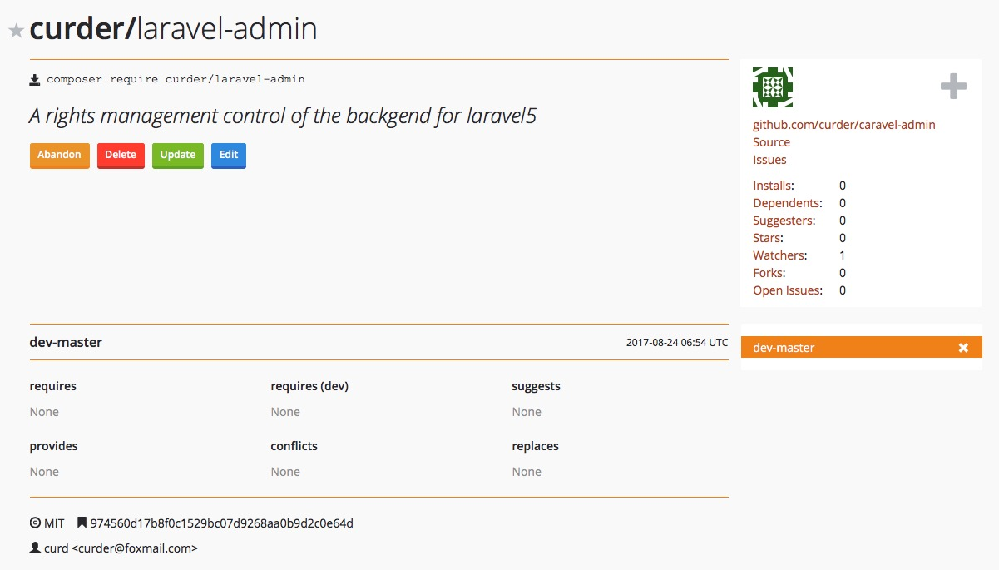

Laravel 5.4
GitHub托管数据
Packagist托管Composer包


首先，使用composer获取到Laravel项目，并做好相关配置。

> 注意： 在下例中使用到 php 相关命令行执行操作的时候，如无特殊说明都是在项目的根目录下操作。

## 创建目录

- 创建`packages`目录存放本地的开发包，
- 在`packages`目录下，创建相应的`vendor`目录，如`github`的用户名等，如这里我使用的`curder`
- 在`curder`目录下创建软件包名称，`laravel-admin`

具体的目录结构如下：

```
app/
artisan/
...
database/
package.json
packages
└── curder
    └── laravel-admin
        └── src
phpunit.xml
public/
...
```

## 修改 `composer.json` 文件

```
"autoload": {
    "classmap": [
        "database/seeds",
        "database/factories"
    ],
    "psr-4": {
        "App\\": "app/"
    }
},
"autoload-dev": {
    "psr-4": {
        "Tests\\": "tests/",
        "Curder\\Admin\\": "packages/curder/laravel-admin/src/"
    }
},
```
> 注意看上述配置中 `Curder\\Admin\\`（命名空间）的值，配置值指向目录真实路径。

## 生成`Provider`并注册

### 创建一个测试文件 Admin.php

文件内容如下：

```
<?php
namespace Curder\Admin;

class Admin {
    public function sayHello() {
        return 'Hello';
    }
}
```

### 生成`Provider`文件并挪到相应位置
使用命令生成一个`Provider`，如下：

```
php artisan make:provider AdminProvider
```
执行完这个命令将生成 `AdminProvider.php` 文件在 `app/providers/`目录下，我们需要将其复制到我的本地packages目录的相应位置，在 `packages/curder/laravel-admin/src/`下，
此时我们可以看到目录下有如下变化：

```
app/
artisan/
...
database/
package.json
packages
└── curder
    └── laravel-admin
        └── src
            └── Admin.php
            └── AdminProvider.php
phpunit.xml
public/
...
```

### 修改Provider文件并注册到Laravel的IOC容器中

打开 `packages/curder/laravel-admin/src/AdminProvider.php`文件，修改`命名空间`和`register()`方法里的相关内容，如下：
```
<?php
namespace Curder\Admin;

use Illuminate\Support\ServiceProvider;

class AdminProvider extends ServiceProvider
{
    /**
     * Bootstrap the application services.
     *
     * @return void
     */
    public function boot()
    {
        //
    }

    /**
     * Register the application services.
     *
     * @return void
     */
    public function register()
    {
        $this->app->singleton('admin',function(){
            return new Admin;
        });
    }
}
```

然后，修改 `config/app.php`中的 `providers`数组的值中添加上面的 Provider，如下：

```
/*
 * Package Service Providers...
 */
Laravel\Tinker\TinkerServiceProvider::class,
Curder\Admin\AdminProvider::class,

...
```

### 测试

```
☁  rbac [master] ⚡ php artisan tinker 
Psy Shell v0.8.11 (PHP 7.1.8 — cli) by Justin Hileman
>>> app('admin')->sayHello();
=> "Hello"
>>>
```

至此，Laravel 就引入本地的插件完毕了，接下来我们将代码放到[GitHub](https://github.com)上托管，然后在[Packagist](https://packagist.org/)拉取代码。

## 将package放到github仓库

### 到github登录自己的账号和密码，创建一个新的仓库并上传源代码



获取到 Remote Addr 后，再回到本地开发目录 `packages/curder/laravel-admin`执行如下命令：

```
git init
git remote add origin git@github.com:curder/caravel-admin.git
git push -u origin master
```

至此代码已经部署到GitHub站点。

登录到GItHub应该就能看到如下图所示的内容：




## 配置github提交时自动通知Packagist

在项目列表下：即 https://github.com/curder/caravel-admin 下点击 "Settings" -> "Integrations & services" -> "Add Service"下拉菜单中选择 "Packagist"，如下图




点击进去后，会需要我们提供 'User' 和 ‘Token’ 信息我们需要登录[Packagist](https://packagist.org/profile/)获取。



将上面获取的两个关键信息填入GitHub的表单中，如下：




## 提交package到Packagist

登录packagist后，点击[submit](https://packagist.org/packages/submit)输入：`https://github.com/curder/caravel-admin`，如下：


成功后会看到如下的界面：



至此，同步完成。


